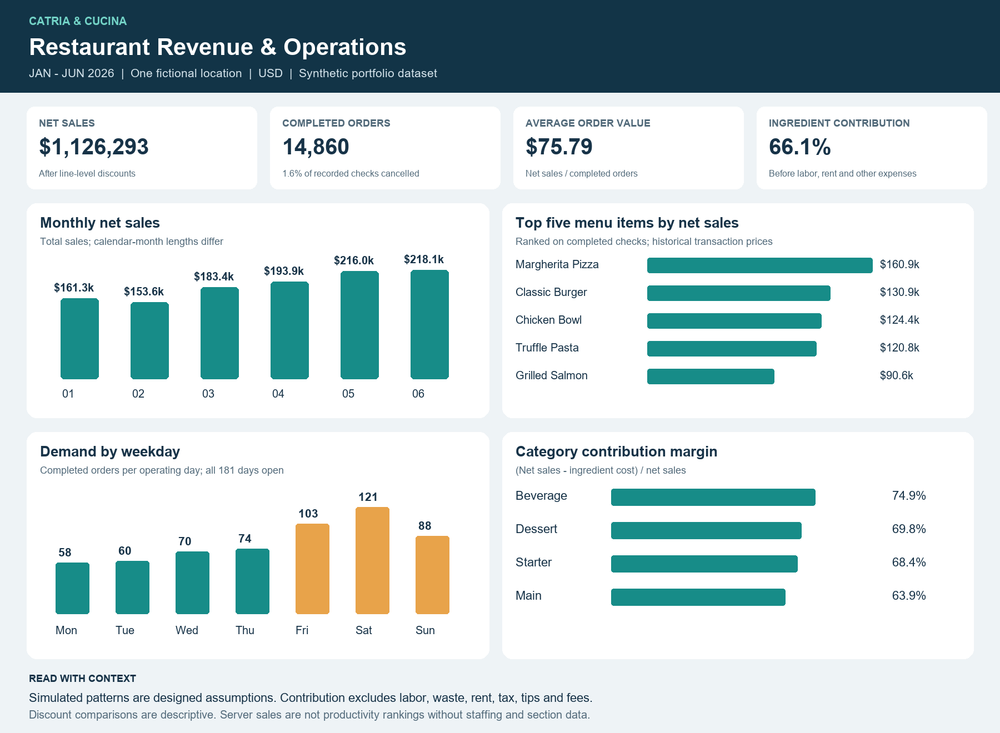
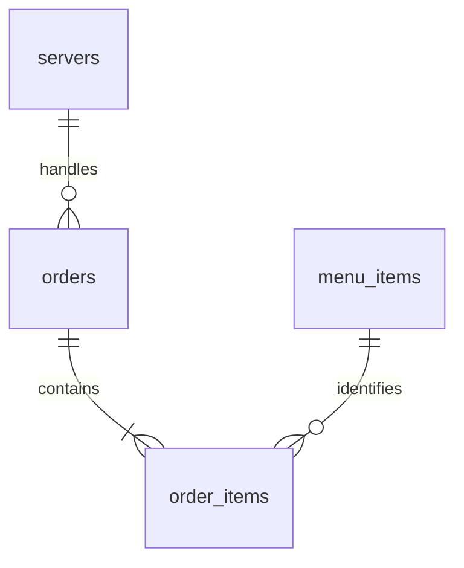

# Catria & Cucina — Restaurant Analytics

An interactive restaurant analytics dashboard and reproducible SQL/Python analysis of revenue, menu performance, and service demand.

The project models **six months of transactions at a fictional restaurant**, connecting order-level operations with item-level sales and ingredient costs. It includes a browser dashboard, a relational MySQL schema, 13 business analyses, and dashboard-ready datasets.

**MySQL · Python · Pandas · JavaScript · GitHub Pages**



## Overview

The analysis addresses four operational questions:

- How do revenue and average check value change over time?
- Which menu items generate the most sales and ingredient contribution?
- When is service demand highest?
- How do discounted checks and dining channels compare?

All records are **synthetic**, generated with a fixed seed. Findings describe the modeled dataset, not the performance of a real restaurant.

## Interactive dashboard

The website includes:

- Revenue, completed-check, average-spend, and contribution-margin metrics.
- Filters for month, dining channel, and menu category.
- Sales trends, revenue mix, and bestselling items.
- Searchable menu rankings by sales, volume, contribution, or margin.
- Weekday/hour demand and service-time comparisons.
- Business findings, metric definitions, and downloadable data and SQL.
- CSV exports of the current filtered summary.

The dashboard runs in the browser using the included dataset. Visitors do not need Python, MySQL, or an account. Category selections calculate item sales and distinct checks containing those items; cancellation rates use period and channel only.

[Web application](docs/WEBSITE.md) · [Metric definitions and assumptions](docs/METHODOLOGY.md)

## Dataset

| Coverage | Details |
|---|---|
| Reporting period | January 1–June 30, 2026 |
| Location and currency | One fictional restaurant · USD |
| Recorded orders | 15,102 |
| Order-item lines | 74,590 |
| Menu items | 22 |
| Staff identifiers | 12 anonymous, fictional identifiers |

The source data include completed and cancelled checks, dine-in and takeaway channels, discounts, service times, and historical price and ingredient-cost snapshots.

## Key results

| Metric | Result |
|---|---:|
| Completed orders | 14,860 |
| Gross sales | $1,153,276.75 |
| Discounts | $26,983.93 |
| Net sales | $1,126,292.82 |
| Average order value | $75.79 |
| Ingredient contribution | $744,310.49 |
| Ingredient contribution margin | 66.08% |
| Cancellation rate | 1.60% |

**Ingredient contribution = net sales − modeled ingredient cost.** It excludes labor, rent, waste, fees, and other operating expenses, so it is not operating profit. Sales exclude cancelled checks, tax, and tips.

## Findings and proposed actions

| Finding | Business implication | Evidence |
|---|---|---|
| February net sales fell 4.7%, but sales per day increased 5.5%. | Compare revenue per operating day alongside monthly totals. | [Monthly KPIs](data/processed/monthly_kpis.csv) · SQL Q02 |
| Saturday averaged 121.3 completed checks, compared with 57.9 on Monday. | Evaluate additional peak-period coverage using service times and labor costs. | [Weekday demand](data/processed/weekday_performance.csv) · SQL Q05–Q06 |
| Margherita Pizza led item net sales at $160,948.30. | Prioritize availability and review preparation capacity for high-volume items. | [Menu performance](data/processed/menu_performance.csv) · SQL Q03 |
| Beverage contribution margin was 74.9%, compared with 63.9% for mains. | Test relevant beverage suggestions and measure contribution per check. | [Category performance](data/processed/category_performance.csv) · SQL Q04 |
| Discounted checks averaged $67.51, versus $77.84 at full price. | Use a controlled promotion test before estimating incremental demand. | [Discount performance](data/processed/discount_performance.csv) · SQL Q08 |

These are descriptive findings and proposed tests. Demand growth, price changes, and service-time patterns are explicit generation assumptions. No intervention outcomes or business improvements were measured.

## Data model



| Table | Grain | Key relationships |
|---|---|---|
| `orders` | One recorded check | Primary key `order_id`; staff reference `server_id` |
| `order_items` | One distinct menu item within a check | Primary key `order_item_id`; references `order_id` and `item_id` |
| `menu_items` | One menu item | Primary key `item_id` |
| `servers` | One fictional staff member | Primary key `server_id` |

Financial calculations use transaction-level price and cost snapshots, preserving historical values when menu prices change. SQL views aggregate item lines to check level before calculating order-level metrics, preventing duplicate counts and basket-weighted service averages.

[Full data dictionary](docs/DATA_DICTIONARY.md) · [MySQL schema](sql/01_schema.sql)

## SQL analysis

The [analysis script](sql/04_analysis.sql) answers 13 business questions using joins, CTEs, conditional aggregation, calendar tables, and window functions:

| Area | Analyses |
|---|---|
| Revenue | Overall KPIs, monthly growth, sales per day, trailing seven-day sales |
| Menu | Item performance, category margins, beverage attachment |
| Operations | Weekday/hour demand, service times, staff check volumes |
| Check economics | Discounts, dining channels, cancellations, guest spend |

Matching Pandas outputs are available in [`data/processed`](data/processed).

## Project documentation

- [Data dictionary](docs/DATA_DICTIONARY.md) — table structure, fields, and units.
- [Methodology](docs/METHODOLOGY.md) — generation assumptions and financial definitions.
- [Dashboard metrics](docs/DASHBOARD_GUIDE.md) — filter behavior and aggregation rules.
- [Web application](docs/WEBSITE.md) — features and architecture.
- [Setup and reproduction](docs/SETUP.md) — Python and MySQL execution.
- [Deployment architecture](docs/PUBLISHING.md) — the GitHub Pages build pipeline.

## Repository structure

```text
├── .github/workflows/       # GitHub Pages deployment
├── data/
│   ├── raw/                 # Source CSV tables and generation manifest
│   └── processed/           # Analysis facts, summaries, and KPIs
├── dist/                    # Interactive website and browser dataset
├── docs/                    # Setup, data dictionary, methodology, and deployment
├── reports/                 # Dashboard image and validation evidence
├── scripts/                 # Data generation, analysis, and verification
├── sql/                     # Schema, imports, views, analysis, and quality checks
├── tests/                   # Python and website calculation checks
├── requirements.txt
└── README.md
```

## Validation

- Seven Python tests passed, covering data contracts, invalid relationships, cancellation handling, rounding, independent financial reconciliation, and reproducible CSV generation.
- Website checks reconcile the headline KPIs to Pandas outputs and test combined filters, calendar denominators, empty states, and CSV export content.
- Desktop and phone layouts were reviewed, including filtering, menu search, sorting, and navigation.
- Native MySQL execution remains unverified. `scripts/verify_mysql.py` compares all 13 SQL analysis results against the Python outputs after the database is set up.

[Python validation](reports/validation.json) · [Test results](reports/test_results.txt) · [Website validation and limitations](reports/web_validation.json)

## Scope and limitations

The dataset does not include customer history, staffing hours, inventory receipts, or post-payment refunds. Discount comparisons are descriptive rather than causal. Staff sales totals do not measure productivity without exposure and workload information.

This project was developed with AI assistance. Its synthetic data, calculation rules, and validation status are documented for reproducibility.

## License

Code, documentation, and synthetic data are available under the [MIT License](LICENSE).
