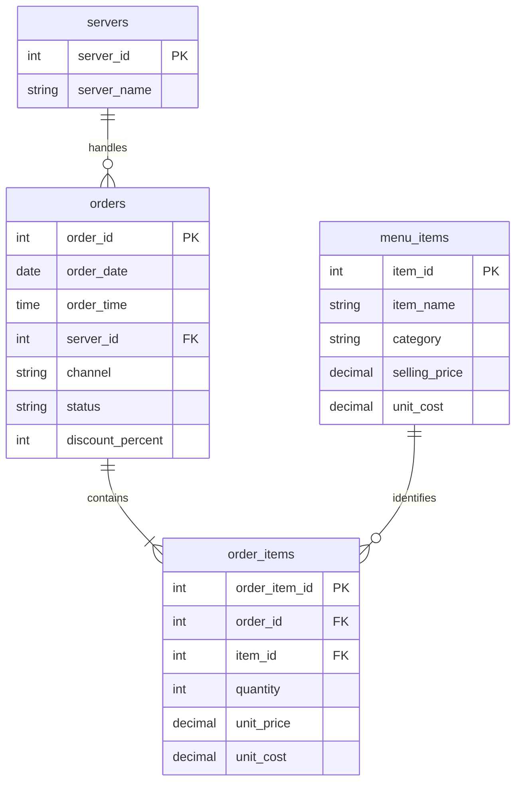

# Restaurant Revenue & Operations Analytics

**A SQL + Python portfolio case study using six months of reproducible, synthetic restaurant transactions.**

Catria & Cucina is a fictional single-location restaurant. This project asks where sales and ingredient contribution come from, when service demand is highest, and what managers should investigate before changing promotions or staffing.

**Scope:** January 1–June 30, 2026 · USD · 15,102 recorded orders · 74,590 item lines · 22 menu items · 12 fictional staff identifiers.


## Interactive website

Explore the project as a browser dashboard with month, channel and category filters, searchable menu performance, weekday/hour demand, business findings and CSV exports. The complete website is included in `dist/`, along with a GitHub Actions workflow that publishes it to GitHub Pages.

**[Publish the live dashboard →](docs/WEBSITE.md)**

No MySQL server or Python installation is needed for visitors. The site computes metrics in the browser from the included synthetic dataset. A public deployment URL will be available after uploading this repository and enabling GitHub Pages; no public deployment has been performed as part of this package.

## Results at a glance

| KPI | Result | Definition |
|---|---:|---|
| Completed orders | 14,860 | Excludes 242 cancelled checks |
| Gross sales | $1,153,276.75 | Completed line quantity × historical unit price |
| Discounts | $26,983.93 | Rounded per line, then summed |
| Net sales | $1,126,292.82 | Gross sales less discounts |
| Average order value | $75.79 | Net sales / completed checks |
| Ingredient contribution | $744,310.49 | Net sales less modeled ingredient cost |
| Contribution margin | 66.08% | Contribution / net sales; weighted ratio |
| Cancellation rate | 1.60% | Cancelled / all recorded checks |
| Dine-in sales per cover | $28.52 | Dine-in net sales / seated guests |

Contribution is **not operating profit**: labor, rent, waste, utilities, fees, tax and tips are outside this dataset.

## Business findings and recommendations

1. **Daily sales rose across the modeled period.** Net sales per calendar day increased from $5,202 in January to $7,271 in June (39.8%). February's total sales fell 4.7%, but sales per day rose 5.5%. Compare per-day metrics before treating a shorter month as weak demand. The generator explicitly introduces demand growth and an April price increase, so this does not establish a real business trend or a causal price effect. Source: Q02 and `monthly_kpis.csv`.
2. **Saturday needs the most service capacity.** There were 121.3 completed checks per Saturday versus 57.9 per Monday. Friday/Saturday at 18:00–19:59 averaged 27.3 minutes to service, versus 19.3 across other times. Trial extra peak coverage and track service time with labor cost and customer feedback; the data cannot determine a staffing headcount. Source: Q05–Q06, `weekday_performance.csv`, and `order_metrics.csv`.
3. **Margherita Pizza leads item revenue.** It generated $160,948.30 in net sales. Maintain availability and review prep capacity for high-volume mains. Beverages had a 74.9% ingredient contribution margin versus 63.9% for mains; test relevant beverage suggestions while tracking contribution per check and customer response. Source: Q03–Q04, `menu_performance.csv`, and `category_performance.csv`.
4. **Discounted checks have lower observed economics.** Discounted AOV was $67.51 versus $77.84 at full price; contribution margins were 62.45% and 66.87%. Promotions occur more often on quieter weekdays. A controlled promotion test, or careful adjustment for timing and basket mix, is needed before estimating incremental demand. Do not call the $26,983.93 discount total recoverable profit. Source: Q08 and `discount_performance.csv`.

Recommendations are proposed tests, not implemented changes or measured business impact. Detailed assumptions are in [Methodology](docs/METHODOLOGY.md).

## Start here

You can review the project without installing anything: read this page, open the dashboard PNG, and browse the CSVs and [finished SQL](sql/04_analysis.sql).

To reproduce locally, use **Python 3.11 or newer** from the repository root:

```bash
python -m venv .venv
# Activate the environment (see docs/SETUP.md for your operating system).
python -m pip install -r requirements.txt
python scripts/analyze.py
python -m unittest discover -s tests -v
```

The raw dataset is included. `python scripts/generate_data.py` recreates it with seed `20260101`; rerun `analyze.py` afterward. Generation replaces the four raw CSVs and their manifest. Analysis replaces derived CSVs, the KPI JSON and dashboard. [Full setup and MySQL import instructions](docs/SETUP.md).

## Relational model



`orders` has one row per check; `order_items` has one row per distinct item within a check, with a quantity. The menu dimension holds end-of-period reference prices. Financial calculations use snapshots on `order_items`. Views first calculate completed line financials, then aggregate to one row per order to avoid duplicating order counts and service times. [Complete data dictionary](docs/DATA_DICTIONARY.md).

## Analysis coverage

| SQL question | Business question | Matching Python output |
|---|---|---|
| Q01 | Sales, discounts, AOV and ingredient contribution | `kpis.json` |
| Q02 | Monthly growth and sales per calendar day | `monthly_kpis.csv` |
| Q03 | Menu revenue, volume and contribution | `menu_performance.csv` |
| Q04 | Weighted category margins | `category_performance.csv` |
| Q05 | Weekday demand per operating day | `weekday_performance.csv` |
| Q06 | Hourly demand and service times | `hourly_demand.csv` |
| Q07 | Server volume and active-day comparisons | `server_performance.csv` |
| Q08 | Discounted versus full-price checks | `discount_performance.csv` |
| Q09 | Dine-in versus takeaway | `channel_performance.csv` |
| Q10 | Cancellation rate by channel | `cancellations.csv` |
| Q11 | Daily sales and trailing seven-day sales | `daily_kpis.csv` |
| Q12 | Beverage attachment rate | `kpis.json` |
| Q13 | Guest spend and check duration | `kpis.json` |

## Repository layout

```text
restaurant-revenue-analytics/
├── README.md
├── LICENSE
├── requirements.txt
├── requirements-mysql.txt
├── data/
│   ├── raw/                 # Four CSV tables + generation manifest
│   └── processed/           # BI-ready facts, summaries and KPI JSON
├── sql/                     # Schema → import → views → analysis → checks
├── scripts/                 # Generator, Pandas analysis, dashboard, MySQL verifier
├── tests/                   # Data-contract, rounding and reconciliation tests
├── dist/                    # Interactive website and generated browser data
├── .github/workflows/       # Checks and automatic GitHub Pages publishing
├── reports/
│   ├── figures/dashboard.png
│   └── validation.json
└── docs/                    # Setup, dictionary, assumptions, BI guide, interview prep
```

## Validation and limitations

The Python pipeline was executed on the delivered CSVs. It checks keys, relationships, date coverage, status rules, table capacity, overlapping seated checks, and financial reconciliation. The test suite uses a separate SQLite aggregation to cross-check financial totals. See [validation evidence](reports/validation.json) and [test results](reports/test_results.txt).

**MySQL runtime validation is pending.** No MySQL server was available in the build environment. The MySQL scripts were reviewed against MySQL documentation; SQLite tests do not validate MySQL syntax or import behavior. After setup, `python scripts/verify_mysql.py` checks imported row counts and compares all 13 MySQL analysis results to the Python outputs. A successful run writes `reports/mysql_validation.json`.

The data are generated and contain designed patterns rather than evidence from a real restaurant. There are no customer IDs, labor shifts, inventory receipts, refunds after payment, or measured intervention outcomes. Staff activity cannot be used as an individual productivity or fairness ranking.

## Interview talking points

- **Grain:** Why summing an order-level value after a one-to-many join can overstate results.
- **Metric contract:** Completed checks, line-level rounding, historical price snapshots and weighted margins.
- **SQL skills:** Joins, CTEs, views, conditional aggregation, recursive calendars and window functions.
- **Validation:** Foreign keys, uniqueness, operational consistency and independent reconciliation.
- **Business judgment:** A shorter month, promotion selection bias, and the difference between contribution and profit.

Use [Interview preparation](docs/INTERVIEW_PREP.md) to learn and explain the code before making first-person skill or ownership claims. This project was assembled with AI assistance; describe your own review, modifications and understanding accurately.

## Dashboard and publishing

The included PNG is a finished static dashboard, not a Power BI or Tableau screenshot. Import the processed facts or summary CSVs into a BI tool using [Dashboard guide](docs/DASHBOARD_GUIDE.md). Upload the **contents of this folder** to a GitHub repository so this README appears on its front page; see [Publishing guide](docs/PUBLISHING.md).

For the interactive browser version, follow [Website publishing](docs/WEBSITE.md). GitHub Actions rebuilds the website data, checks its calculations, and publishes only the `dist/` folder to Pages.

## Technical references

- [MySQL: loading data](https://dev.mysql.com/doc/refman/8.4/en/loading-tables.html)
- [MySQL: LOCAL data loading controls](https://dev.mysql.com/doc/refman/8.4/en/load-data-local-security.html)
- [MySQL: window functions](https://dev.mysql.com/doc/refman/8.4/en/window-functions.html)

All transaction data are generated by the included script. No third-party restaurant dataset or personal information is used. Code, documentation and synthetic data are provided under the [MIT License](LICENSE).
